  

  🎓 مهندسی کامپیوتر، دانشگاه صنعتی شریف
  &nbsp;•&nbsp; 📍 تهران
  &nbsp;•&nbsp; 🌐 <a href="https://hashemian1382.github.io/">وب‌سایت شخصی</a>
  &nbsp;•&nbsp; ✉️ <a href="mailto:aho.hashemian@gmail.com">aho.hashemian@gmail.com</a>

  می‌سازم در نقطه‌ی تلاقیِ <b>تئوری ریاضیات</b>، <b>معماری سیستم‌های توزیع‌شده</b> و <b>مدل‌سازی سیستم‌های پیچیده</b> —
  جایی که دقت آکادمیکِ شریف به سرعتِ اجرای محصول واقعی پیوند می‌خورد.

---

<h3 align="center">🧭 حوزه‌های تمرکز</h3>

  🎲 نظریه‌ی بازی‌ها و سیستم‌های چندعامله
  &nbsp;•&nbsp; 🧬 بیوانفورماتیک و هوش زیستی
  &nbsp;•&nbsp; 📈 اقتصاد محاسباتی
  &nbsp;•&nbsp; 🧠 فلسفه‌ی ذهن و استدلال در AI

  

---

<h3 align="center">⭐ پروژه‌های منتخب</h3>

| پروژه | توضیح | تکنولوژی |
|---|---|---|
| [ai-chatbot](https://github.com/hashemian1382/ai-chatbot) | پلتفرم چت‌بات استریمینگ LLM با SSE، حافظه‌ی نشست Redis و پرامپت‌های ماژولار | JavaScript · SSE · Redis |
| [University-Lost-Found](https://github.com/hashemian1382/University-Lost-Found) | سامانه‌ی اشیای گم‌شده‌ی شریف؛ تطبیق معنایی متن و تصویر بر پایه‌ی امبدینگ‌ها | Python · Embeddings |
| [Breast-Cancer-miRNA-Analysis-2026](https://github.com/hashemian1382/Breast-Cancer-miRNA-Analysis-2026) | بازتولید، راستی‌آزمایی و نوآوری پژوهش Shimomura؛ تشخیص سرطان پستان از miRNA | Python · LDA · XGBoost |
| [telegram-ai-content-manager](https://github.com/hashemian1382/telegram-ai-content-manager) | مدیریت و تولید محتوای تلگرام با دستیار هوش مصنوعی | Python · LLM APIs |
| [my-persian-os](https://github.com/hashemian1382/my-persian-os) | شبیه‌ساز وبِ سیستم‌عامل شخصی فارسی — آزمایشگاه مهندسی نرم‌افزار شریف | JavaScript |
| [thesis](https://github.com/hashemian1382/thesis) | پایان‌نامه: سامانه‌ی پرسش‌وپاسخ هوشمند وب مبتنی بر RAG با مسیریابی هوشمند | RAG · LLM · FastAPI |

<a href="https://github.com/hashemian1382?tab=repositories">📦 مشاهده‌ی همه‌ی مخازن</a>

---

<h3 align="center">🔬 اکنون در آزمایشگاه</h3>

  🤖 عامل‌های هوشمند خودگردان <code>reading · prototyping</code> 
  🕸️ RAG پیشرفته و گرافی <code>experimenting</code> 
  🦀 Rust و همروندیِ کارایی‌بالا <code>learning by building</code>

---

  «اگر دقیقاً می‌دانید چه سیستمی می‌خواهید، با تمیزترین کد و سریع‌ترین کارایی ممکن ساخته می‌شود؛
  و اگر در آغاز راهید، کمک می‌کنم ابهام به شفافیت و ایده به معماری درست تبدیل شود.»

  <a href="https://hashemian1382.github.io/">🌐 وب‌سایت</a> •
  <a href="mailto:aho.hashemian@gmail.com">✉️ ایمیل</a> •
  <a href="https://github.com/hashemian1382?tab=repositories">📦 همه‌ی مخازن</a>

